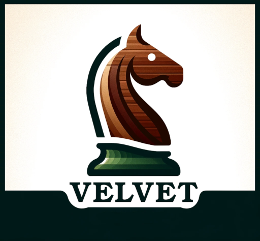

## :chess_pawn: Velvet Chess Engine

[](logo/velvet_logo.png?raw=true)


[](https://www.gnu.org/licenses/gpl-3.0)

**Velvet Chess Engine** is a UCI chess engine written in [Rust](https://www.rust-lang.org).

Version 8.0.0 is currently ranked around 3639 Elo (Blitz) and 3537 Elo (40/15) in the Computer Chess Rating Lists (CCRL):
- [CCRL Blitz](https://www.computerchess.org.uk/ccrl/404/cgi/compare_engines.cgi?family=Velvet&print=Rating+list)
- [CCRL 40/15](https://www.computerchess.org.uk/ccrl/4040/cgi/compare_engines.cgi?family=Velvet&print=Rating+list)

In Fischer Random Chess, the single-threaded rating is around 3837 Elo:
- [CCRL 40/2 FRC](https://www.computerchess.org.uk/ccrl/404FRC)

In order to play against Velvet, you need a Chess GUI with support for the UCI protocol.

### Features

#### Configurable strength

In order to make Velvet a viable sparring partner for human players of different skill levels, its strength can be limited.
To enable this feature, set `UCI_LimitStrength` to true and adjust `UCI_Elo` to your desired Elo rating (between 1225 and 3000).

Please note that these Elo ratings might not yet correspond well to Elo ratings of human players.
A better calibration would require a lot of games against human players of different skill levels.
I recommend to experiment with different settings to find the optimal match for your current skill.

In addition, the new `SimulateThinkingTime` option allows Velvet to mimic human-like thinking times by utilizing a portion of its remaining time budget.
You can disable this feature by setting `SimulateThinkingTime` to false.

These options can be combined with the "style" settings.

#### Support for different playing styles

Velvet offers two distinct embedded neural networks, each designed to reflect a different playing style.
You can easily toggle between these styles using the `Style` UCI option to match your strategic preferences.

* **Normal Style**: The default setting, offering a balanced approach to gameplay. While Velvet is still capable of sacrifices and aggressive attacks, it places slightly more emphasis on avoiding unfavorable positions if an attack doesn’t succeed, compared to the Risky style.
* **Risky Style**: This setting pushes Velvet to adopt a bolder, more aggressive approach, taking greater risks to create dynamic and challenging positions on the board.

Note: the riskier playing style comes with the downside, that the strength is reduced by around 25 Elo depending upon the opponent.

#### Multi PV Support for Analysis
Velvet can analyze multiple lines of play simultaneously to provide a deeper understanding of positions by showing the top N moves.
The number of variations can be configured using the UCI `MultiPV` option.

#### Endgame Tablebase Support
The engine supports to probe up to 7-men Syzygy tablebases to improve evaluations of endgame positions.

#### Ponder Support
Pondering allows the engine to think during the opponent's turn.
This setting is disabled by default, but can be enabled using the `Ponder` UCI option.

#### FRC and DFRC Support
Besides standard chess, Velvet also supports the variants Fischer Random Chess (FRC or Chess960) and Double Fischer Random Chess (DFRC).

#### Cross-Platform Support
Velvet binaries are available for Windows, macOS and Linux in the download section of the [releases page](https://github.com/mhonert/velvet-chess/releases) page.

#### Parallel Search
Velvet uses Lazy SMP to make use of multi-core processors.

### :inbox_tray: Download

Executables for Windows, macOS and Linux can be downloaded from the [releases page](https://github.com/mhonert/velvet-chess/releases).

### :computer: Manual compilation

Since Velvet is written in Rust, a manual compilation requires the installation of the Rust tool chain (e.g. using [rustup](https://rustup.rs/)).
The installed Rust version must support the Rust 2021 Edition (i.e. v1.56 and upwards).

Then you can compile the engine using **cargo**:

```shell
cargo build --release --bin velvet
```

To compile the engine without Syzygy tablebase support (e.g. when the target architecture is not supported by the Fathom library),
you can pass the `no-default-features` flag:

```shell
cargo build --no-default-features --release --bin velvet
```

### :scroll: License
This project is licensed under the GNU General Public License - see the [LICENSE](LICENSE) for details.

### :tada: Acknowledgements
- The [Chess Programming Wiki (CPW)](https://www.chessprogramming.org/Main_Page) has excellent articles and descriptions
- A big thanks to all the chess engine testers out there
